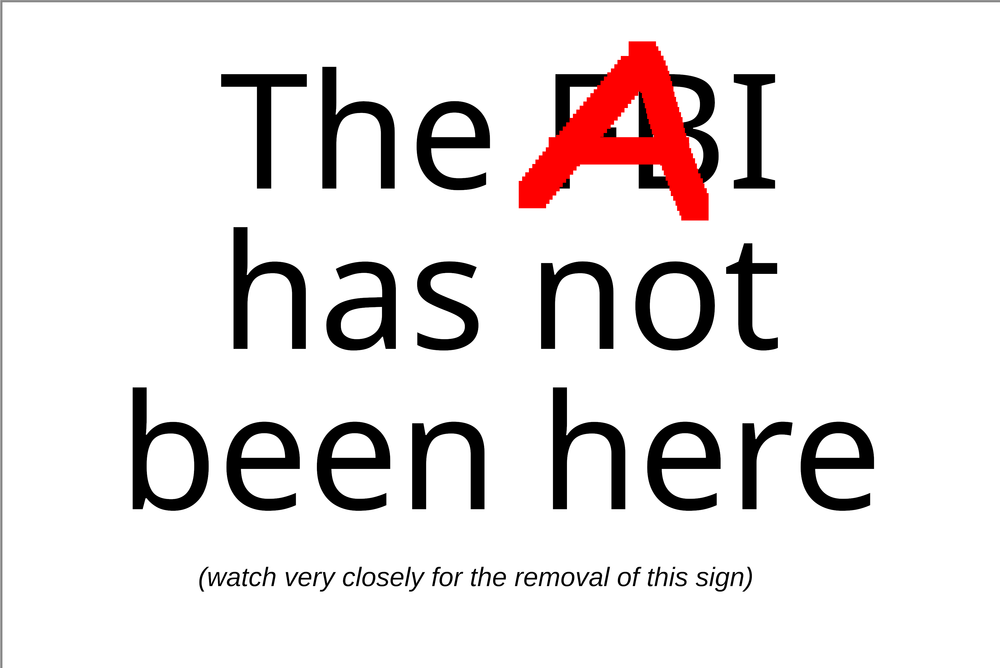

# Clanker Canary

This is a [preemptive canary](https://en.wikipedia.org/wiki/Warrant_canary) to indicate that your content is of human origin, which removal implicitly informs viewers that clankers got to it.

## Usage

### Creating and signing

- Make ecdsa keys and distribute pub key

- Download the [canary.txt file](canary.txt)

- Add your digests

- `openssl dgst -out canary.sig -sign private.pem canary.txt`

- Publish `canary.txt` and `canary.sig` alongside your content

### Verifying

- `openssl dgst -verify public.pem -signature canary.sig canary.txt`
